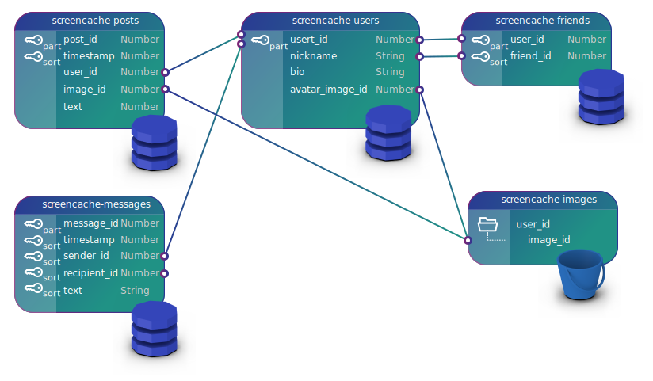

# Screen Cache Database

Screen Cache business models are stored in DynamoDB as normalized JSON documents, following the guidelines described in [DynamoDB Patterns for Ultra-High Performance Apps](https://www.slideshare.net/AmazonWebServices/amazon-dynamodb-design-patterns-for-ultrahigh-performance-apps-dat304-aws-reinvent-2013-28436991). 

Posts are indexed for full-text search in Elasticsearch by using insert/update triggers on `screencache-posts` table.

User uploaded images are stored in S3 bucket `screencache-images`, in folders with a unique numeric id for each user. Each image has a unique numeric id. The image URL can be calculated by combining the S3 bucket URL with `user_id` and `image_id`.

## Tables

### screencache-posts

|Property|Type|Key|Description|
|-|-|-|-|
|post_id|Number|Partition Key|Unique post id|
|timestamp|Number|Sort Key for Primary and Secondary Index|Unix epoch timestamp|
|user_id|Number|Secondary Index|User id|
|image_id|Number||Screenshot image id (stored in `screencache-images` S3 bucket under user id)|
|text|String||Screenshot annotation|

### screencache-users

|Property|Type|Key|Description|
|-|-|-|-|
|user_id|Number|Partition Key|Unique user id|
|nickname|String||Unique user nickname|
|bio|String||Self-described blurb|
|avatar_image_id|Number||Avatar image id|

### screencache-friends

|Property|Type|Key|Description|
|-|-|-|-|
|user_id|Number|Partition Key|The user sending the friend request|
|friend_id|Number|Sort Key|The user accepting the friend request|

### screencache-messages

|Property|Type|Key|Description|
|-|-|-|-|
|message_id|Number|Partition Key|The unique message id|
|sender_id|Number|Sort Key|The sender user id|
|recipient_id|Number|Sort Key|The recipient user id|
|text|String||The message text|
