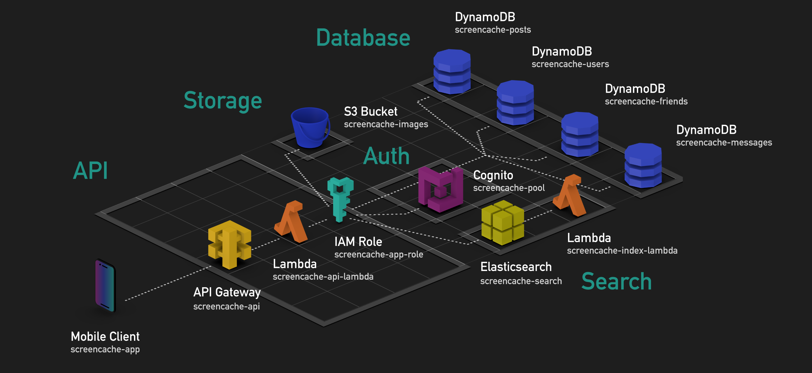

# Screen Cache Architecture

## Infrastructure Overview

The services used in Screen Cache technology stack ensure maximum scalability and availability of `99.9%`:

|Stack|Service|Scalability|Availability|Pricing|
|-|-|-|-|-|
|Database|DynamoDB|Provisioned or on-demand by region or global (unlimited)|[99.99%](https://aws.amazon.com/dynamodb/sla/)|[DynamoDB pricing](https://aws.amazon.com/dynamodb/pricing/)|
|Full-Text Search|Elasticsearch|EC2 cluster by instance size with attached EBS storage|[99.9%](https://aws.amazon.com/elasticsearch-service/sla/)|[Elasticsearch pricing](https://aws.amazon.com/elasticsearch-service/pricing/)
|File Storage|S3|Standard or Infrequent Storage (unlimited)|[99.9%](https://aws.amazon.com/s3/sla/)|[S3 pricing](https://aws.amazon.com/s3/pricing/)|
|API|Lambda|Millions of requests|[99.99%](https://aws.amazon.com/lambda/sla/)|[Lambda pricing](https://aws.amazon.com/lambda/pricing/)|
|API|API Gateway|Millions of requests|[99.99%](https://aws.amazon.com/api-gateway/sla/)|[API Gateway pricing](https://aws.amazon.com/cognito/pricing/)|
|Authentication|Cognito|[Millions of users](https://docs.aws.amazon.com/cognito/latest/developerguide/limits.html)|[99.9%](https://aws.amazon.com/cognito/sla/)|[Cognito pricing](https://aws.amazon.com/cognito/pricing/)|

### Operating Cost

The minimum cost of maintaining Screen Cache infrastructure in Oregon (`us-west-2`) is `$30.78/mo`:

* `$3.5/mo` for `API Gateway` required to run the serverless API
* `$26.28/mo` for a single `t2.small.elasticsearch` instance
* `$1/mo` for `10 GB` of EBS attached to the elasticsearch instance.

Charges will appear only for API Gateway and Elasticsearch if the other services stay within [free tier limits](https://aws.amazon.com/free/):

|Service|Free Tier Limits (monthly)|
|-|-|
|DynamoDB|25 GB, 200M requests|
|Elasticsearch|750 compute hours, 10 GB on t2.small.elasticsearch (not free after 12 months)|
|S3|5 GB, 20K downloads, 2K uploads|
|Lambda|1M requests|
|API Gateway|1M requests|
|Cognito|50K user logins|

For both API Gateway and Elasticsearch, billing begins 12 months after AWS account creation. Until then, the cost of running Screen Cache on a brand new AWS account is `$0` which is useful for testing and evaluation.
